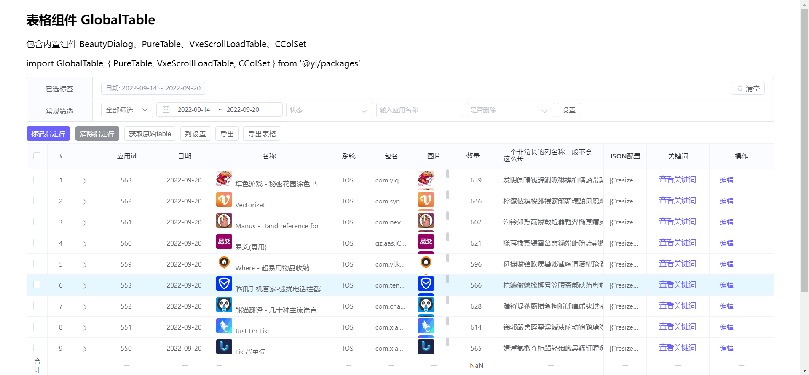
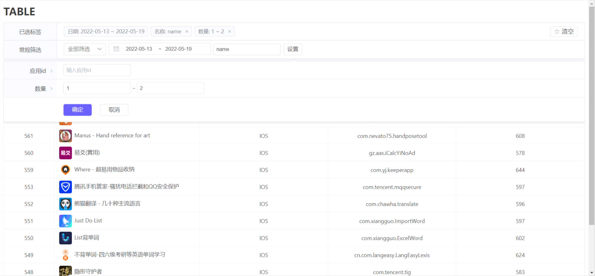

# choco-table
 基于Vue Vxe table 的2次开发表格组件

> base on vxe table

## install

``` bash
npm install choco-table
```

## 使用

``` bash
// main.js
import GlobalTable from '@youmi/choco-table'
import '@youmi/choco-table/lib/choco-table.css'

/* 定义默认请求方法，（在非自定义组件方法时使用） */
import { getConfig, getList, searchPageOptions, exportTable, submitForm } from '@/mock-api/table'
const options = {
  getConfig, // 全局获取tableConfig方法
  getData: getList, // 全局获取tableData方法
  submitForm, // 提交表单
  searchOptions: searchPageOptions, // 搜索selectOption选项
  exportTable // 导出表格
}

Vue.use(GlobalTable, options) // 加载全局配置

// App.vue
<global-table :config="{ tableId: '8848' }" />
```




##Options配置

[前端表格设计](https://conf.umlife.net/pages/viewpage.action?pageId=106889620)
[前端表格配置文档](https://conf.umlife.net/pages/editpage.action?pageId=94019810)

