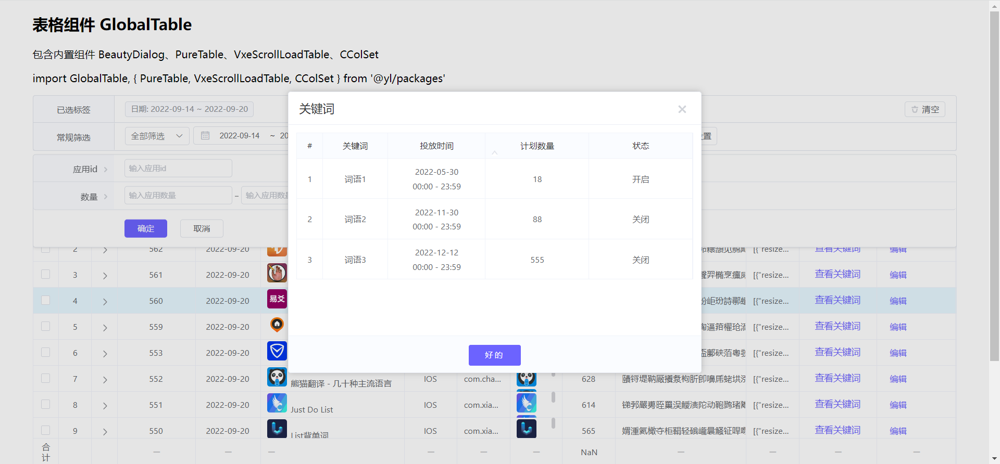

# choco-table
 基于Vue Vxe table 的2次开发表格组件

> base on vxe table

## install

``` bash
npm install choco-table
```

## 使用

``` bash
// main.js
import GlobalTable from '@youmi/choco-table'
import '@youmi/choco-table/lib/choco-table.css'

/* 定义默认请求方法路径，如不使用自定义方法则会向该路径发起请求 */
const config = {
  getConfigUrl: process.env.VUE_APP_BASE_API + 'api/admin/globalTable/getTableConfig', // 获取tableConfig
  getListUrl: process.env.VUE_APP_BASE_API + 'api/admin/globalTable/getTableList', // 获取tableData
  submitFormUrl: process.env.VUE_APP_BASE_API + 'api/admin/globalTable/submitForm', // 提交表单
  searchOptionsUrl: process.env.VUE_APP_BASE_API + 'api/admin/globalTable/searchPageOptions', // 搜索selectOption选项
  exportUrl: process.env.VUE_APP_BASE_API + 'api/admin/globalTable/exportTable' // 导出表格
}

Vue.use(GlobalTable, config) // 加载全局配置

// App.vue
<global-table :config="{ tableId: '8848' }" />
```




##Options配置

[前端表格设计](https://conf.umlife.net/pages/viewpage.action?pageId=106889620)
[前端表格配置文档](https://conf.umlife.net/pages/editpage.action?pageId=94019810)

